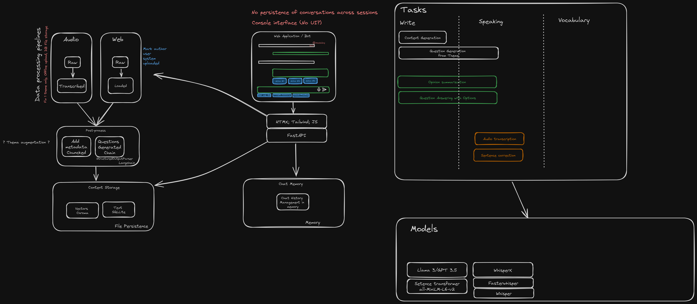

# 👩‍🎓 Motivation

Learning a language has always been a challenging task for me because like many I'm often afraid of producing language.
Despite significant effort, and money spent learning German, I still have a mediocre domain of the language.
A great teacher would create a safe and maybe private environment for me to produce the language, and be available all the time, while using content that interests me.
That teacher never existed for me. ChatGPT app came closer to it, but given it's general purpose nature, I was never able to shape it to be the teacher I wanted.
This project is my attempt to combine different NLP techniques to get closer to that reality.

## ⬇️ Data Sources

Most of the models used are trained models without fine tuning.

To set the context for the user interaction, the user upload content they find interesting. At this stage news articles (html) & podcast (audio files) are supported.

The behavior was validated against (German Language)

- https://www.tagesschau.de/thema/ki (Tagesschau Thema)
- https://www.ardaudiothek.de/sendung/ki-verstehen/94617540/ (ARD Podcast)

As content is uploaded by the user the thema is defined & updated automatically.

## :dependabot: Language Learning Copilot

The goal of the copilot is to instigate the user to product the target language.

A few questions the copilot might ask:

- Summarize a given content (e.g. news article or podcast)
- Generate a random question within the context of the theme where the answer can be found directly in the content

then the :bowtie: user will answer either:

- By writting
- Or speaking

This means we get the user audio and transcribe it to text.
Then the text is corrected by the AI automatically before following with the next questions.

## 🧹 Pipelines

#### Audio ingestion pipeline

- Whisper transcription (Model: Whisper)

#### Web ingestion article

- Text extraction (BeautifulSoup)

#### Text ingestion pipeline

- Generate AI text

#### Content processing pipeline

- Chuncking the text (Langchain)
- Embedding (Model: TBD)
- Vector storage (Database: TBD)

#### Question post processing pipeline

Ideally I would do this as an event. For the sake of this project, I will do on-demand.

- Summarization (Model TBD)
- Theme identification (Model: Bert). Each model gets a theme, and the user can switch between themes.
- Question generation (Model: GPT 3.5, Llama 3)
- Answer search (Vector search or Model: Bert)

Where could I train my own model?
Where could I fine-tune my model?
Where could I use a trained model without fine tuning?

## 🕸️ App

The app is built with FastAPI. The UI is built with Tailwind, Preline, and interactions are handled with htmx.

Currently the app has:

- Chat with history (ephemeral)

## 🦋 Deployment

The app has been deployed to fly.io using Docker for demonstration.

## How to run

Install python dependencies
```
conda env create -f environment.yml
```
or
```
conda env update -f environment.yml
```

Install node dependencies (tailwind, preline)
```
sudo apt update && sudo apt install -y nodejs npm
cd ./app
npm install
```

Add private key to .env file
```
cp .env-sample .env
```
Then edit the .env file and add your OpenAI/Groq API key.

Run the app
```
uvicorn app.service.main:app --host 0.0.0.0 --port 8080 --reload
```

## :dependabot: Architecture


